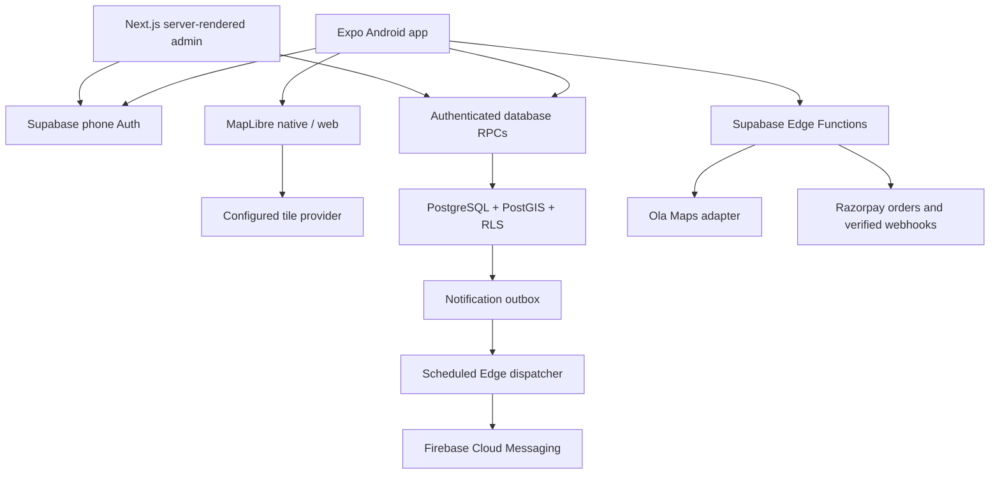

# Architecture

## Boundaries

- `apps/mobile/src/live` contains the real client, service modules, reusable UI, translated screens, and native/web adapters. No production action reads the old AsyncStorage demo database.
- `apps/mobile/PreviewApp.tsx` preserves the earlier visual preview. It runs only in a development build with `EXPO_PUBLIC_DEMO_MODE=true`. Release mode always selects the live app.
- `apps/admin` is a separately installable Next.js application. Every privileged server action revalidates the user and database admin membership. No service-role key is used in this app.
- `packages/core` holds shared form validation. Metro watches this directory explicitly.
- `supabase/migrations` is the authority for state, ownership, expiry, privacy, credits, and moderation. Clients have read-only table grants with RLS; mutations use an explicit RPC allowlist.
- `supabase/functions` hosts external service adapters. Secrets never enter the client bundle. A server endpoint validates the caller even when the platform JWT precheck is disabled.

## Jobs and applications

A draft is created idempotently using a per-user request UUID. Publishing locks the job and conditionally debits one credit in the same transaction. Repeating publication does not charge again. Reposting creates a new job linked through `repost_of`.

Discovery applies geography, expiry, kind, category, text, language, employment type, and minimum pay filters in SQL, returning at most 20 jobs. Mobile pagination never downloads the full marketplace. Approximate positions are rounded to 0.01 degrees and distance to a 500 m band. Exact coordinates and address remain in `job_locations`.

Accept/reject actions lock the job before the application, preventing overfilling. Withdrawal is allowed only before acceptance. Work starts after the job is filled. Both parties confirm completion per application; reviews require that completed relationship.

## Payments and notifications

Razorpay order amounts are read from database packages. A compare-and-set reservation prevents concurrent creation for one request. An ambiguous provider response leaves the order reserved for operator reconciliation. Do not blindly create a replacement order after a timeout.

Only signed `payment.captured` webhooks can settle an order. The database checks amount/currency, locks the order, enforces unique provider IDs, and writes credits once. Native checkout success is not treated as a credit grant.

Notifications are persisted with unique event keys and then sent through an outbox with retry/backoff. Delivery is at-least-once; rare duplicate push delivery after a crash is possible. Consumers can deduplicate by `notification_id`. The inbox remains the source of truth.

## Limits of the current implementation

This is not a claim that every master-prompt feature has shipped. See `production-readiness.md` for unfinished UX, integration checks, hosting, and native release work. No AI, chat system, or worker job-access fee has been introduced.
